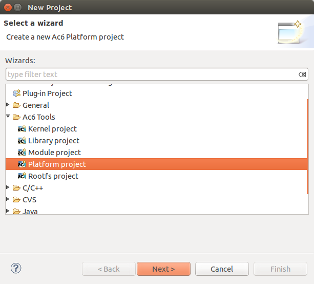
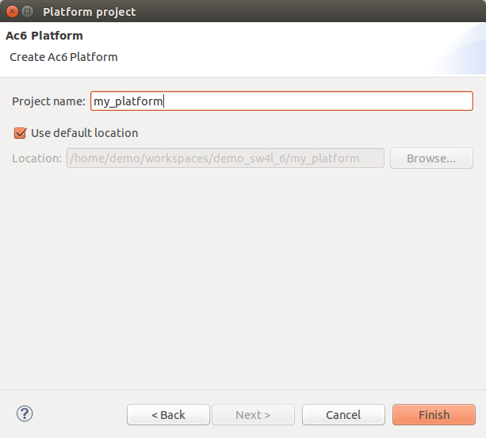

=========================
Create a Platform project
=========================

To create a new Platform, Go to File > New > Project... and select
Platform project under Ac6 Tools folder. Then click on the Next button
to open the wizard.

On the next page, enter the new project name (such as “my_platform”)
then click on the Finish button. Your project will be created and is
accessible on your workspace. You can choose the location of your
project but it is recommended to use the default location.

