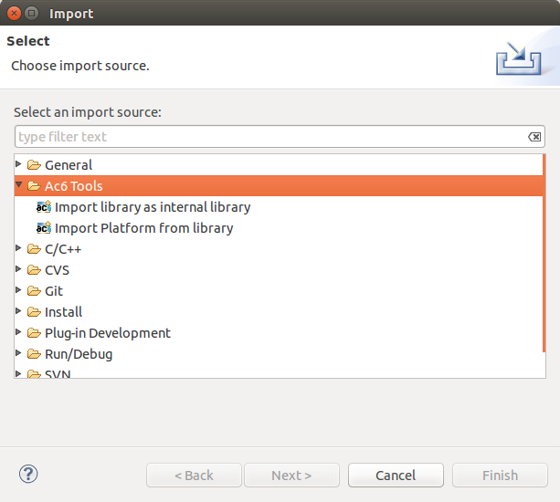

========================================
Create a platform project from a library
========================================

System Workbench for Linux is provided with libraries. A library are a
set of predefined and ready-to-use platforms and packages. To import a
platform from library:

Select File > Import… > Ac6 Tools > Import platform from internal
library. Choose the library by selecting the library name then its
version. The list of available platform is displayed on the table below,
select one the push Finish. The platform is imported with copy and
visible in the workspace.

Note: To avoid usage conflict, only one Platform project can exist in
the current workspace. If you need to work on another Platform, please
switch workspace (File > Switch Workspace)

