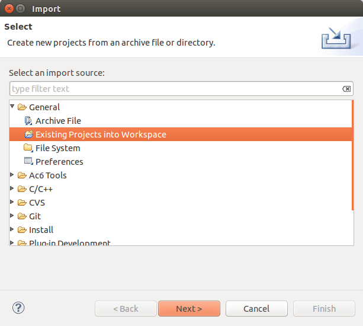

=========================
Import a Platform project
=========================

Select File > Import… > General > Existing project into Workspace.
Choose the directory or archive where your Platform project is located,
then select your project to import it into the workspace. To avoid
unexpected behavior with the platform, we recommend you to activate Copy
project into Workspace check-box. It imports the whole project contents
into the workspace location by copying it. If not check, the project
will be accessed by linking it to its original location.

