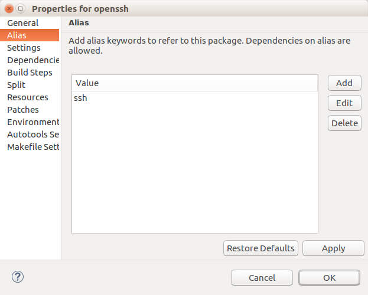

=======================
Modify platform content
=======================

The Platform is made up of a set of project definitions classified in
package (application, libraries...) definitions, kernel definition and
root file system definition. Each package definition should be unique
and is specified by its name, version and revision.

When imported, these project definitions turns into ECLIPSETM projects
and are displayed in the Project explorer view.

--------------

.. _About:

Packages Tree Editor Page
-------------------------

This page show a tree of supported packages with their summary
information. The child elements indicated the packages whom it depends.

To manage the package definition, right-click on an item to display the
actions (refer to Actions on Packages definition)

--------------

.. _About:

Linux Kernel and RootFS Page
----------------------------

This page shows the list of supported kernels and Rootfs. More kernel or
Rootfs definition can be added. The Linux kernel sources can be
“vanilla” distributions or vendor distributions.

To manage the kernel or Rootfs definition, right-click on an item to
display the actions (refer to Actions on Packages definition chapter)

--------------

.. _About:

Action on Platform contents
---------------------------

.. _About:

Add Package
~~~~~~~~~~~

To add a package, right-click on the package table then select New
package. On the new window, enter the package minimal information

-  Name
-  Version
-  Revision (the default value is "r0")
-  Language: Package sources programing language (C, C++ ...)
-  Type: Package project type (Makefile, Autotools ...)
-  Location type (Remote archive, Local archive, GIT ...)
-  Source URI

When created, the new package definition has some default settings. The
user usually needs to provide more information or build options to
complete and validate a package definition. Note: A package definition
is unique. Its UID is created from the name, version and revision.

When created, the new package definition has some default settings. The
user usually needs to provide more information or build options to
complete and validate a package definition. Note: A package definition
is unique. Its UID is created from the name, version and revision.

.. _About:

Delete Package
~~~~~~~~~~~~~~

To delete a package definition, right-click on the package table then
select Delete package. A pop-up dialog asks you to confirm the action.

When deleting, it removes the package definition from the platform and
delete all its related files from platform metadata directory.
Dependencies on this package are also removed. This action is not
reversible.

.. _About:

Import Package
~~~~~~~~~~~~~~

If you have create an Eclipse project supported by System Workbench
(such as C/C++ with Cross GCC toolchain) and you want to import it to
your working platform , right-click on the table, select Import package
> from workspace. Choose the project to import from the new window. A
“New Package” window appears with information pre-filled.

If you have a System Workbench for Linux library installed on your
system, you can also import a package from a library. Right-click on the
table, select Import package > from library. Select the library then the
list of packages available is displayed. Importing a package means
importing all its dependencies if not found in your platform.

--------------

.. _About:

Actions on Packages definition (Packages, Kernels, Rootfs)
----------------------------------------------------------

-  **Build:**\ Launch the « Build » build step with its dependencies
-  **Rebuild:**\ Force the « Build » build step and its dependencies
-  **Clean:**\ Launch the « Clean » build step with its dependencies
-  **Execute task:**\ Execute the selected task only
-  **Force task:**\ Force the selected task execution
-  **Force task then rebuild**\ Force the selected task execution the
   launch « Build » step.
-  **Properties:**\ To watch or edit the package definition properties,
   Right click on the package table then select “Properties”. It opens
   the properties dialog (see “Package properties” section)

--------------

.. _About:

Package properties
------------------

This dialog allows to edit properties, build settings and build sequence
of the selected package.

General information about the package (name, version, revision,
source…).

The package can be classified into section to organize it by its usage
(use separator “/” for ordering the sections, for example:
“console/network” for a network console app like OpenSSH).

A package source can be fetched from:

-  A local folder
-  A local tarball (on your machine or locally stored in the platform,
   use URI starting with “file://” if the tarball is in the package
   resources folder)
-  A remote tarball (enter the tarball URL)
-  A source control management such as GIT or Subversion (enter the
   repository URI and inform the branch and revision)

To increase download verification level for remote tarball, you can
inform the source file MD5 and SHA256 hash.

**Warning:** Some values are not editable because they provide unique ID
or are attached to specific features. If you need to modify them, please
delete the package definition first or create a new one with higher
revision.

.. _About:

Alias
~~~~~

Aliases are keywords that can be used to refer to a package (or to
inform its functionality). A package can have a strict dependency on
another package but can also depends on an alias. On this page, any
aliases can be added or removed.

*Example:* OpenSSH and Dropbear applications provide client/server and
tools for SSH-protocol. Both has the “ssh” alias in their definition. If
your application needs SSH protocol but does not require any particular
package, in your package definition, you will add a dependency (runtime
or build-time) with the “ssh” alias. While building your package, if a
preferred package associated to “ssh” alias is detected, it is built
otherwise a window is displayed to asks you to build OpenSSH or Dropbear
(The selection is saved as preferred value afterward).

.. _About:

Settings
~~~~~~~~

Edit the general package settings. This page inherits from the Platform
language configuration page. If the package does not required specific
settings compared to the platform settings, select the “Use settings
from platform configuration” box.

Uncheck this box if the package settings should be different or more
accurate.

**Note:** The settings are usually not modified. This option can be
useful for occasional specific cases.

.. _About:

Dependencies
~~~~~~~~~~~~

In this page, add or edit dependency to another package/alias (Runtime,
Build-time …). Click on the Add button to select whose packages/alias it
depends and the type of dependency. **Warning:** Cyclic dependency is
forbidden.

.. image:: ../images/gettingstarted/ac6platform/platform_edit8.png

.. raw:: html
   

   
   
   

When a dependency is set, a link is defined between the tasks from the
two packages and the complete build sequence is updated following the
rules:

-  Build time: To configure the package then build it, the package, to
   which it depends, has to be installed in the sysroot.
-  Runtime: To execute the package binaries, it requires the other
   package to be installed in the Rootfs (shared libraries
   dependencies).

**Note:** A virtual dependency with the selected compiler package (see.
Platform Configurations) is set even if not selected. When a package is
getting built, the compiler package has to be present and selected in
the platform configurations editor tab.

.. _About:

Build Steps
~~~~~~~~~~~

This page displays a hierarchical list of the tasks (also called
“steps”). The menu on the right provide actions on these build steps.
The table lists the tasks with their name and their last execution date.
The “To recalculate” means the task has been invalidated, is not
executed yet or an error has occurred on the previous run. The main and
mandatory tasks are Build and Clean. These tasks themselves have no
action but are the head entry to launch sequence of tasks.

When adding a new task, on the new modal dialog, enter the new task name
and its description. On the tab below, you can associate a shell script
to the task (the script will be copied into the platform internal
folder). Some command (such as Install step) should be performed as
system administrator (under root permission). If so, please check the
Under Fakeroot box. Fakeroot provides a fake root environment where user
can run commands under root privileges for file manipulation. The files
ownerships and permissions that were modified under fakeroot are saved
in a description file (in System Workbench for Linux, this file is named
.fakeroot), thus it is possible to restore the fakeroot environment for
other steps. Several internal tasks already exist. If their behavior
matches your needs, you can select Use Internal task then choose the
existing task from the displayed list. The Name and Description value
are automatically filled. Otherwise, you can completely create your own
script then select it the User user script area.

On the Ordering tab, set the tasks before and after (Note: Circular
dependencies are not permitted).

On the Dependency tab, set the task before from another package, if not
needed, let the value as default

On the Variables tab, set the environment variable which are visible
only on the task-level when this task is executed. If the variable is
already defined in package or platform level, the task-level one
override the existing variable.

While executing the build, a task tree is generated. A task is ready to
be executed when its “before” tasks are done. If a task execution ends
in failure, it halts the build. (See. Build System) It is also possible
to edit some internal task (task provided by the IDE) by pushing button
Edit. On this page, you can disable parallel build and force the task to
be re-executed every time it is called. If the task has a script, push
the Edit button next to the script name area to open to script editor in
background. Put your mouse pointer on the script filename to show the
full location. You can also add prepend or append scripts, These scripts
are concatenated to the main script on execution.

**Note for advanced use:** When a script is modified, it is copied into
the platform ($PLATFORM_LOC/metadata/packages[or
kernels/rootfs]/$PACKAGE_ID/buildsteps/scripts) in the package metadata
so the behavior is not changed globally but only for the edited package.
To change the task behavior globally, put the script on the
platform-level ($PLATFORM_LOC/scripts). Every tasks with the same
filename as script will run this script when executed. To change back to
the default script, the custom scripts should be deleted.

.. _About:

Split
~~~~~

Page to define sub-packages created from the install step output. Each
sub-package defines a specific purpose and is associated to a filter
pattern. To populate the sub-package, the files and folders from the
temporary installation directory which match the pattern are retrieved
and stored into the sub-package tarball feeds.

The following common sub-packages are defined by default:

-  **base:** items that must always be installed
-  **dev:** items for development: header files, pkgconfig files,
   libtool files...
-  **dbg:** items for delivery with debug feature unstripped
-  **doc:** items for delivery with generated documentations: man,
   html...
-  **locale:** items related to internationalization
-  **config:** configuration files
-  **shlibs:** shared libraries
-  **staticdev:** static libraries

.. _About:

Resources
~~~~~~~~~

This page displays a list of the resources to be copied into sources
when the Build step “Copy Resources” is executed. Every added items are
duplicated into the platform (in $PLATFORM_DIR/metadata/packages[or
kernels/rootfs]/$PACKAGE_ID/resources). On the “Copy Resources” step,
the provided items are copied into the package project root location.
For the files, it overwrites existing ones. For the folder, it merges
the folders contents.

.. _About:

Patches
~~~~~~~

This page lists the patches to apply to the sources when the build step
“Apply patches” is called. The patches are applied in alpha-numerical
order.

When added, the patch file is copied locally into the platform metadata
(in $PLATFORM_DIR/metadata/packages[or
kernels/rootfs]/$PACKAGE_ID/patches). When “Apply patches” step is
executed, it searches the patch files in alphanumerical order then
patches the package project root directory. If the patch is in a folder,
it is apply under the same folder in the package project location.

*Example:*

-  p001-root.patch is applied to $PACKAGE_ROOT_LOCATION
-  src/p002-src.patch is applied to $PACKAGE\_ ROOT_LOCATION/src

.. _About:

Environment variables
~~~~~~~~~~~~~~~~~~~~~

Edit the environment variables on the package-level. These variables can
be set to provide additional information to the build steps scripts or
the Makefiles (such as CFLAGS or LDFLAFS...)

If the variable already exists on platform-level, it will override it.
To append or prepend value to a platform-level variable, add the suffix
“_append” or “_prepend” to your new variable name.

**Warning:** Value separators are not automatically added, do not forget
to add them if needed.

*Example:*

-  VAR=value1
-  VAR_append=;value2
-  VAR_prepend=value0;
-  On build: VAR=value0;value1;value2

.. _About:

Specific settings
~~~~~~~~~~~~~~~~~

Edit the type-specific settings and build settings.

.. _About:

On Makefile definition
^^^^^^^^^^^^^^^^^^^^^^

Set the build parameters or extra flag on the compile (make all) or
install (make install) steps commands.

.. _About:

On Autotools definition
^^^^^^^^^^^^^^^^^^^^^^^

Set the flag to add arguments for the script configure then generate the
Makefile. Set the build parameters or extra flag on the build (make all)
or install (make install) commands.

.. _About:

On Kernel definition
^^^^^^^^^^^^^^^^^^^^

On the Kernel General page, set general settings for kernel as the
architecture and the image format.

On the Kernel configuration page, select specific kernel options such
default configuration and device tree.

.. _About:

On Rootfs definition
^^^^^^^^^^^^^^^^^^^^

Select the packages (and sub-packages) to install into the Rootfs. When
a package is installed into the rootfs project, it implicitly installs
its needed dependencies.

--------------

