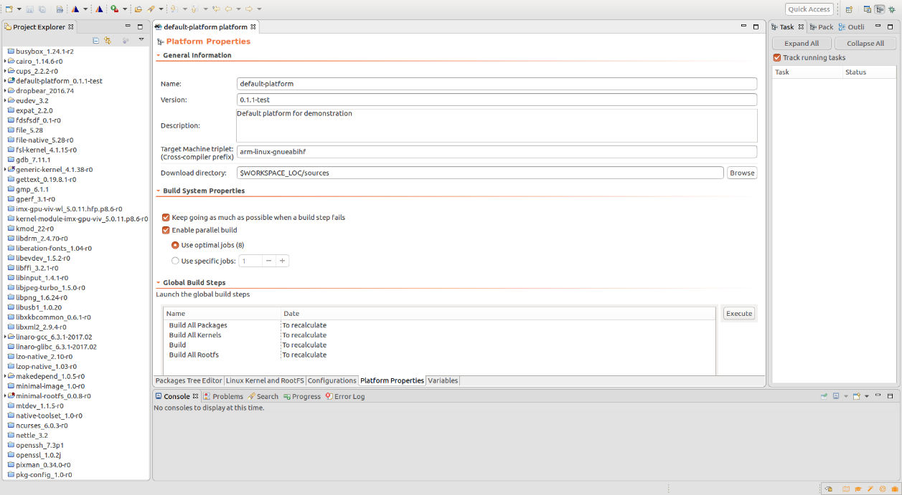
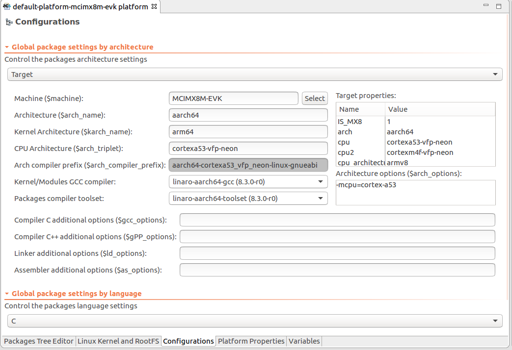

=====================================
Platform properties and configuration
=====================================

--------------

.. _About:

Properties page
---------------

Enter the platform general properties. In this tab, you can enter your
cross-compiler prefix (the compiler should be found in the PATH
variable). If needed, the directory where the sources file are
downloaded can be changed.

.. _About:

General Information
~~~~~~~~~~~~~~~~~~~

-  Name
-  Version
-  Description
-  Target Machine triplet: the GCC toolset prefix which is used to build
   the packages
-  Download directory: Sources target location when downloaded.

.. _About:

Build system Properties
~~~~~~~~~~~~~~~~~~~~~~~

-  Enable keep going if build fails: The build does not stop at the
   first error
-  Enable parallel build: Execute multiple steps in parallel

.. _About:

Global Build Steps
~~~~~~~~~~~~~~~~~~

-  Build all packages
-  Build all kernels
-  Build all Rootfs (will build every Rootfs and the packages to
   populate them)
-  Build (will build every contents on the platform)

--------------

.. _About:

Configurations Page
-------------------

To configure your build settings and language settings, select the
Configuration tab in the Platform editor. These settings are propagated
in the package settings.

.. _About:

Configure architecture settings
~~~~~~~~~~~~~~~~~~~~~~~~~~~~~~~

Edit the target and host settings. Most of the time, the host (or
native) settings should not be modified. On contrary, if not configured
yet, the user should select the board and set the compiler architecture
options (CPU, FPU ...)

-  Architecture: Target general architecture.
-  Machine: Name of the target machine (can be selected from a list).
-  CPU Architecture: CPU Specific architecture (fpu, cpu...).
-  Compilers/Toolset: The compilers to use to build platform packages
   and kernel.
-  Arch compiler prefix: Prefix generated from the previous values.
-  Architecture options: Options flags which will be append to the GCC
   commands.
-  Compiler additional options: Options flags which will be append to
   the compiler commands.
-  Linker additional options: Options flags which will be append to the
   linker commands.
-  Assembler additional options: Options flags which will be append to
   the assembler commands.

.. _About:

Configure language settings
~~~~~~~~~~~~~~~~~~~~~~~~~~~

Edit the global settings for the every supported languages.

The compiler and toolset is separated because the kernel and the
packages can be built with different compilers. The kernel and its
modules has to be built by a GCC compiler and does not requires any
other installation on the rootfs. On contrary, the packages needs the
library C to be installed in the rootfs to be executed.

--------------

.. _About:

Variables Page
--------------

The Variables page displays the list of user variables, internal
variables (default and read-only variables used by System Workbench) and
the system variables. Internal variables are read-only. User variables
can be added, edited or deleted. The variables are visible by the build
steps scripts.

Platform-level environment variables are persistent in the
package-level. Environment variables package-specific can also be added.
(To set package-level variable, see Package Properties)

