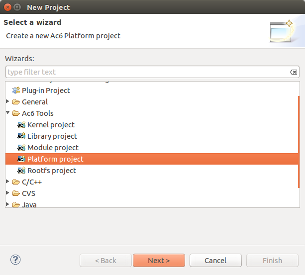

Kernel settings
===============

To configure the Kernel setting, please go to the project properties by right-clicking on the project then choose Properties. On the Kernel tab, user can change the cross-compiler. Select the image output format and the start address if needed. A default configuration can be set by selecting the target configuration and applying them. Some additional features can still be configure, thus click on the Configure… button to open the Kernel configuration window.

