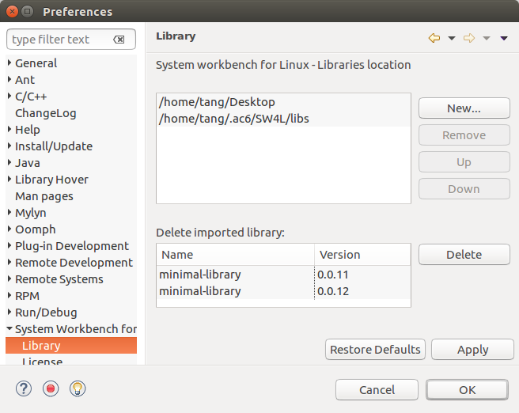

===================
Library preferences
===================

On Windows > Preferences > System Workbench > Library, change or add
directories where libraries are installed. On the second table, imported
libraries can be deleted if not used or deprecated. Warning, this action
remove files and is definitive.

--------------

