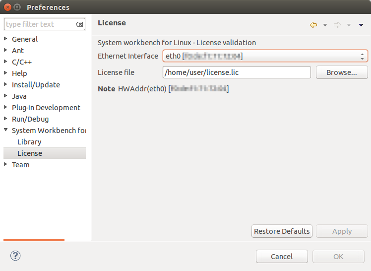

License
=======

Ac6 System Workbench for Linux is a software under license. A license
file for each machine is required. Please contact tools@ac6-tools.com to
ask for more information. Your MAC address is needed.

Go to *Window > Preferences > System Workbench > License*, select the
Ethernet interface to which the license is attached then enter the
license file. Push the **Apply** button to validate.

If the license is valid, the editors and every features are enabled
otherwise an error message is displayed on this page and the main
features are not accessible.

--------------
