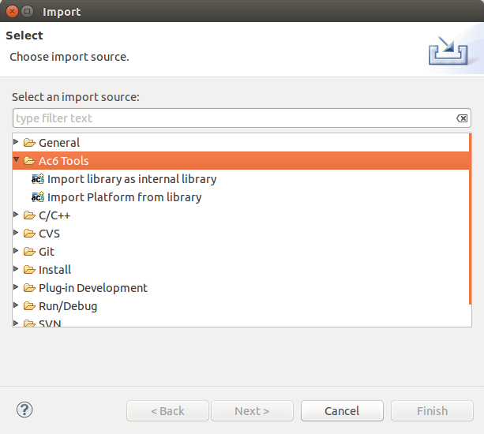
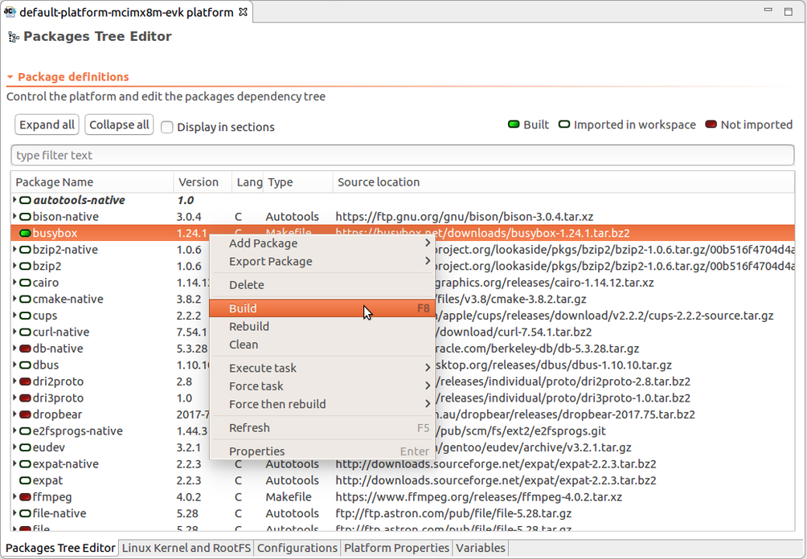

===========
Quick Start
===========

.. _DemoContent:

Demonstration content
---------------------

This demonstration consist on an external library which has a set of
pre-configured packages in a default platform:

Kernel:

-  Linux Kernel 4.19.35

Toolchain:

-  GCC Linaro arm-linux-gnueabihf 8.3-2019.03

Linux Packages:

-  Busybox (Many common UNIX utilities in small size executable)
-  Dropbear (Small SSH server and client)
-  Eudev (udev fork from Gentoo, device file manage for Linux kernel)
-  Expat (Library to parse XML)
-  File (Utility to get file type)
-  Gdb (GNU Project debugger, include Gdbserver)
-  Gmp (Library for operation on numbers)
-  Kmod (Program to manage Linux Kernel modules)
-  Libusb1 (Application for easy access to USB devices)
-  Ncurses (Library to manage display on character-cell terminals)
-  Nettle (Low-level cryptography library)
-  OpenSSH (Connectivity tool for remote login with SSH protocol)
-  OpenSSL (Library for TLS and SSL protocols and crytography)
-  Qt (Cross-platform application framework for graphical application)
-  Strace (Tool to trace system calls and signals)
-  Tslib (Library for touchscreen access)
-  Usbutils (Tool to display information about USB buses)
-  Zlib (Compression library)

This minimal platform has been created for i.MX8M and tested on
MCIMX8M-EVK board. It can be adapted for your own ARM-based device.

.. _ImportDemo:

Import demonstration platform
-----------------------------

Select *File > Import... > Ac6 Tools > Import platform from internal
library*.

Choose the library then select the provided platform. The platform will
be imported with copy and visible in the workspace.

**Note**: To avoid conflict, only one Platform project can exist in a
workspace. If you need to work on another Platform, please switch
workspace (*File > Switch Workspace*)

.. _OpenEditor:

Open the platform editor
------------------------

To get all the views dedicated to the platform usage, please open the
“Ac6 Platform” perspective. To open this perspective, go to *Window >
Open Perspective > Other...* then select *Ac6 Platform*.

On the newly imported project named minimal-platform_X.X.X, click on the
ac6_platform_manifest.xml file to open the platform editor. This
multi-page editor provides you content description and control on the
platform.

.. _BuildPackage:

Build a package
---------------

On the Packages Tree Editor tab, select a package (such as busybox),
right click on it then select Build. It performs the full build
sequence. Follow the process on the Task tracker view and exit messages
on the Console view.

.. _BuildKernel:

Build a kernel
--------------

Open the "Linux Kernel and Rootfs" editor page. As for the package,
select "linux-imx-git" then build it. The output are under the newly
created project “_install” directory.

.. _BuildRootfs:

Build a minimal rootfs image
----------------------------

On the right table, find the list of rootfs images defined in the
platform. To know the list of packages or packages groups which are
installed into the final image, go to the rootfs properties, then click
on the Rootfs page

To select the output image format (and size if needed), open the Output
page from the Properties.

To build the rootfs image, right-click on the rootfs and select Build.

Building a rootfs image means building every packages selected first
then populate the rootfs with their binaries, shared libraries,
configuration files, ... The result is placed into the rootfs project
"output/images" directory.

.. image:: ../images/quickstart/quickstartimg6.png

--------------
