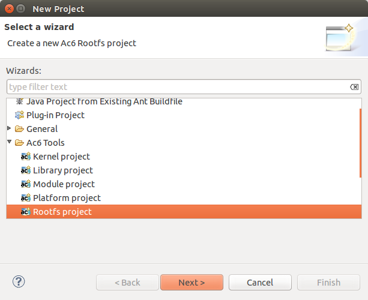

=========================
Create a Rootfs project
=========================

To create a new Rootfs project, Go to File > New > Project... and select
Rootfs project under Ac6 Tools folder. Then click on the Next button to
open the wizard.

On the next page, enter the new project name (such as “my_rootfs”) then
click on Finish button. Your project will be create and is accessible on
your workspace. You can choose the location of your project but it is
recommended to use the default location.

