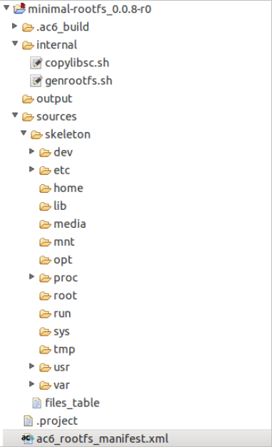

========================
Rootfs project structure
========================

The Rootfs project is composed of the following elements:

-  internal: folder with the internals shell scripts for rootfs project
   specific actions.
-  output: project output folder where the rootfs image will be
   generated.
-  sources: folder where the raw rootfs skeleton and a description file
   are.
-  ac6_rootfs_manifest.xml: manifest file to store general settings and
   open rootfs editor.

