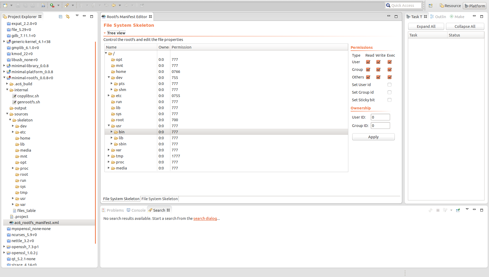

==============
Rootfs Editor
==============

To open the Rootfs Editor, double-click on the ac6_rootfs_manifest.xml or right-click on the file then select Open with > Rootfs Manifest Editor.

.. _About:

File System Skeleton Page
-------------------------

On the File System Skeleton tab, the whole skeleton content is display
on the left frame. The tree is composed of the items in the
source/skeleton folder. If this folder is edited, please close then
reopen the editor to resynchronize the view. On the right area, one can
edit the file permission and ownership id. These values are effective
when the rootfs will be generated from the Platform.

--------------

.. _About:

Fstab Page
----------

On this page, edit your fstab according your target memory layout. An
additional column is present to inform the size of a physical partition
(mostly use if you need to split the filesystem in ext2/3/4 format) On
the properties page, the fstab can be used to generate split
filesystems.

--------------

.. _About:

Filesystem properties
---------------------

General information can be modified on this page.

Select the final rootfs formats. The rootfs can either on file or
divided following the fstab description. For “ext” formats, please enter
the rootfs partition size.

--------------

.. _About:

Rootfs scripts
--------------

When the file system skeleton is configured, the generation shell script
needs to be updated, thus right-click on rootfs project and select
Generate script. The internal/genrootfs.sh is updated to match the
modifications. The genrootfs.sh is used to copy the skeleton from the
source folder and apply the chosen permission and ownership. This script
can be edited manually to add some actions. To avoid conflict, please
add the code strictly under the USER CODE brackets.

The internal scripts are launch on the Rootfs definition build steps in
a Platform, especially in the “Generate skeleton” step. The plug-in Ac6
Linux Kernel features are described in the following part. With this
plug-in, a Linux Kernel project are supported into ECLIPSE™ and can be
configured and built.

--------------