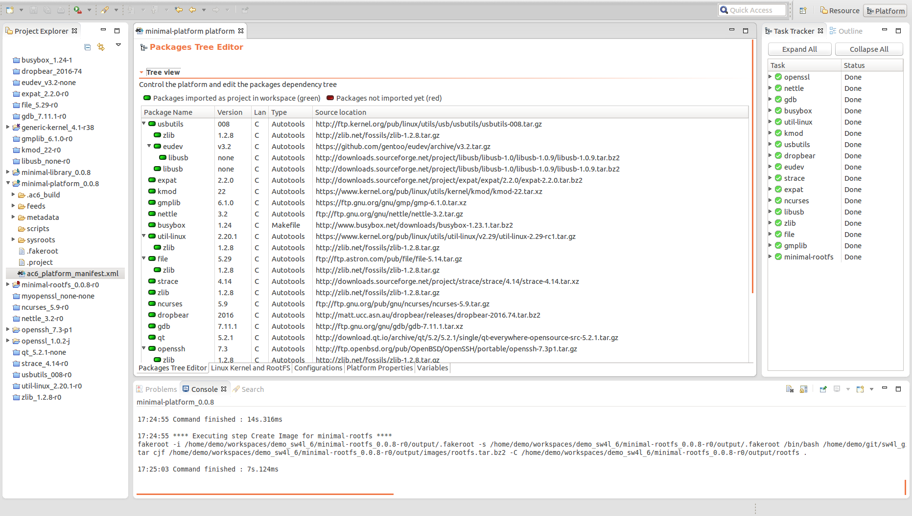
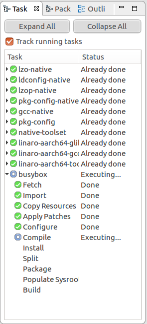
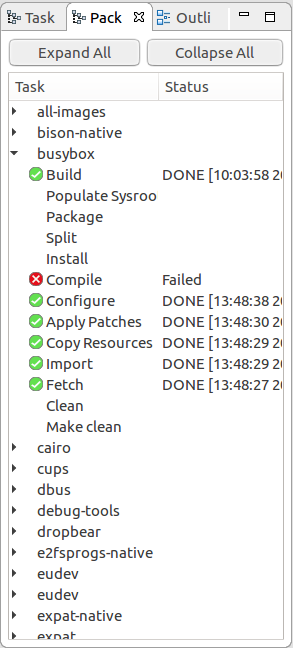

=====
Views
=====

Views support editors and provide alternative presentations as well as
ways to navigate the information in your Workbench. For example, on the
left side, the Project Explorer displayed by default and other
navigation views display resources that you are working with.

.. _prjexplorer:

Project explorer
----------------

The **Project Explorer** View provides a hierarchical view of the
ECLIPSE project.

To add the Project Explorer view to the current perspective, click
*Window > Show View > Other... > General > Project Explorer*.

.. _tasktracker:

Task tracker
------------

The **Task Tracker View** displays the executed tasks (filtered by
package) from a Platform artifact build sequence and their status are
displayed. It shows the currently executed task, the task done and the
task ended in error to track which step is running.

To add the Task tracker, Go to *Window > Show View > Other... > Platform
> Task Tracker*.

==== ======== ===================================
Icon Status   Description
==== ======== ===================================
\    OK       The task has been successfully done
\    On going The task is currently executed
\    Pause    The task is pending
\    Failed   The task has failed
==== ======== ===================================

Some actions can be trigger on this view, right-click on the element to
show the menu:

| - On package: Build or Rebuild
| - On task: Execute, Force Execute or Display log (if a log file
  exists)

.. _buildtracker:

Packages Build tracker
----------------------

The **Package Build tracker** view lists all the package definitions
added to the platform. The user can know the build status for any
packages.

To add the Packages Build tracker, *Go to Window > Show View > Other...
> Platform > Packages Build Tracker*

Console
-------

The **Console View** displays a variety of console types depending on
the type of development and the current set of user settings.

+---------+------------------+------------------+------------------+
| Command | Name             | Description      | Availability     |
+=========+==================+==================+==================+
|         | Clear console    | Clears the       | Context menu and |
|         |                  | currently active | view action      |
|         |                  | console, and is  |                  |
|         |                  | available as     |                  |
|         |                  | both a view      |                  |
|         |                  | command and a    |                  |
|         |                  | contextual menu  |                  |
|         |                  | item.            |                  |
+---------+------------------+------------------+------------------+
|         | Display selected | Opens a listing  | View action      |
|         | console          | of current       |                  |
|         |                  | consoles and     |                  |
|         |                  | allows you to    |                  |
|         |                  | select which one |                  |
|         |                  | you would like   |                  |
|         |                  | to see.          |                  |
+---------+------------------+------------------+------------------+
|         | Open console     | Opens a new      | View action      |
|         |                  | console of the   |                  |
|         |                  | selected type.   |                  |
+---------+------------------+------------------+------------------+
|         | Pin              | Pins the current | View action      |
|         |                  | console to       |                  |
|         |                  | remain on top of |                  |
|         |                  | all other        |                  |
|         |                  | consoles.        |                  |
+---------+------------------+------------------+------------------+
|         | Scroll lock      | Changes if       | Context menu and |
|         |                  | scroll lock      | view action      |
|         |                  | should be        |                  |
|         |                  | enabled or not   |                  |
|         |                  | in the current   |                  |
|         |                  | console.         |                  |
+---------+------------------+------------------+------------------+

--------------

